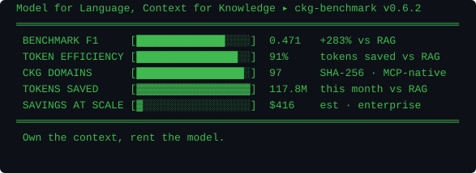

<!-- TELEMETRY_START -->

<!-- TELEMETRY_END -->

<div align="center">

[](https://pypi.org/user/danyarm/)
[](https://registry.modelcontextprotocol.io)
[](https://graphifymd.com)
[](https://graphifymd.com/paper.html)
[](https://huggingface.co/danyarm)
[](https://graphifymd.com)

[](https://github.com/Yarmoluk/langchain-ckg)
[](https://github.com/Yarmoluk/llamaindex-ckg)
[](https://github.com/Yarmoluk/crewai-ckg)
[](https://github.com/Yarmoluk/zep-ckg)
[](https://elevenlabs.io)
[](https://github.com/Yarmoluk/ckg-nvidia-ai)
[](https://github.com/Yarmoluk/ckg-mcp)
[](https://smithery.ai/server/@Yarmoluk/ckg-mcp)
[](https://registry.modelcontextprotocol.io)

</div>

---

Agents need certainty. LLMs give probability. **Compact Knowledge Graphs (CKGs)** are the missing layer — structured, auditable domain knowledge served over MCP. 269 tokens per query vs 2,982 for RAG. F1 0.471, +283% vs RAG baseline. SHA-256 provenance on every node. Drop-in MCP servers, no infra required.

**New: CKG Router** — deterministic context + model routing from graph depth. `route_query()` returns the right subgraph AND the right model tier (haiku/sonnet/opus) derived from hop count. No heuristic — the graph decides. 4× more accurate, 90% cheaper, routed automatically.

---

## Packages

| Package | Domain | F1 | Downloads |
|---------|--------|----|-----------|
| [**ckg-mcp**](https://github.com/Yarmoluk/ckg-mcp) | 97 domains · full stack · CKG Router | — |  |
| [**ckg-nvidia-ai**](https://github.com/Yarmoluk/ckg-nvidia-ai) | NVIDIA AI · NIM · NeMo · 20 domains · 1,055 nodes · CKG Router | — |  |
| [**ckg-nvidia-nemoclaw**](https://github.com/Yarmoluk/ckg-nvidia-nemoclaw) | NemoClaw · 55 nodes / 74 edges · CKG Router | **0.576** |  |
| [**ckg-agentforce**](https://github.com/Yarmoluk/ckg-agentforce) | Salesforce AgentForce · billing + permissions · CKG Router | — |  |
| [**ckg-nemotron-perplexity**](https://github.com/Yarmoluk/ckg-nemotron-perplexity) | Nemotron + Perplexity Sonar · 83 nodes | — |  |
| [**langchain-ckg**](https://github.com/Yarmoluk/langchain-ckg) | LangChain retriever · CKGRetriever + CKGHostedRetriever | — |  |

```bash
uvx ckg-mcp              # 97 domains — any agent stack
uvx ckg-nvidia-ai        # NVIDIA AI · NIM · NeMo · NemoClaw
uvx ckg-agentforce       # Salesforce AgentForce

# CKG Router — deterministic context + model routing
route_query("TensorRT-LLM", "nvidia-tensorrt-triton")
# → model_tier: opus · reasoning: sparql_cot · why: 4-hop chain
# → context subgraph: 847 tokens (not 10,000)
```

---

## Benchmark

| System | Macro F1 | Tokens/query | Cost @ $10/1M |
|--------|:--------:|:------------:|:-------------:|
| **▸ CKG** | **0.471** | **269** | **$0.003** |
| RAG | 0.123 | 2,982 | $0.030 |
| GraphRAG | 0.120 | 3,450 | $0.035 |

`ckg-benchmark v0.6.2` · 97 domains · [dataset](https://huggingface.co/datasets/danyarm/ckg-benchmark) · [paper](https://graphifymd.com/paper.html) · patent pending

F1 scales with hop depth: `0.374 → 0.772` at hop=5. RAG plateaus at hop=2.

---

## Pricing

| Tier | Calls | Price | Best for |
|------|-------|-------|----------|
| Free | 50/day | — | Evaluation |
| **Dev** | Unlimited | **$10/yr** | Solo devs, small teams |
| Pro | Unlimited + priority | $99/yr | Production |
| Sealed | On-prem Docker appliance | $299 | Enterprise / air-gap |

[**Upgrade → graphifymd.com/pricing**](https://graphifymd.com/pricing) · [Dev $10/yr](https://buy.stripe.com/00wbJ1gsYcm01tC52A1kA08)

---

<div align="center">

[](https://github.com/Yarmoluk)


---

[graphifymd.com](https://graphifymd.com) · [LinkedIn](https://www.linkedin.com/in/danyarmoluk/) · [PyPI](https://pypi.org/user/danyarm/) · [HuggingFace](https://huggingface.co/danyarm) · [MCP Registry](https://registry.modelcontextprotocol.io)

</div>
