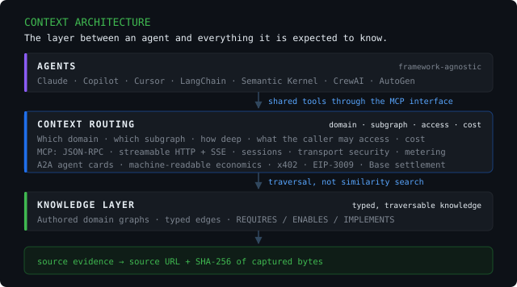
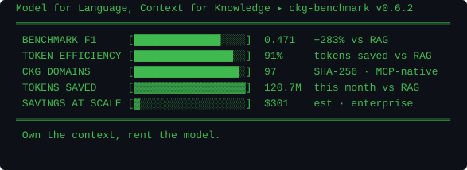

<h1 align="center">Daniel Yarmoluk</h1>

<strong>Forward Deployed Engineer · AI Solutions Architect</strong> Minneapolis, MN

<h3 align="center">Give agents the right knowledge. Know where it came from.</h3>

I build **context architecture**: the layer that routes an agent to the relevant knowledge, controls the cost of retrieving it, and preserves the source evidence behind the result.

Fifteen years in enterprise architecture, most recently delivering Fortune 500 AI at Slalom. I like the deployed half of the job: the customer's environment, its constraints, and the failure modes that never appear in a demo.

[**Portfolio & resume ↗**](https://yarmoluk.github.io) &nbsp;·&nbsp; [**Discuss a role ↗**](mailto:daniel.yarmoluk@gmail.com?subject=Forward%20deployed%20engineering%20role) &nbsp;·&nbsp; [**Discuss a project ↗**](mailto:daniel.yarmoluk@gmail.com?subject=Context%20architecture%20project)

[LinkedIn](https://linkedin.com/in/danyarmoluk) · [Graphify.md](https://graphifymd.com) · [PyPI](https://pypi.org/user/danyarm/) · [Hugging Face](https://huggingface.co/danyarm)

  
  
  
  
  
  
  
  
  
  

---

## The work

**One hard problem:** agents can call powerful models, but useful answers depend on what context reaches them. I work across that whole path, from the customer's source material to the context an agent receives and the behavior we can inspect after deployment.

| Build | What it does | See it |
|:--|:--|:--|
| **Context routing** | Selects the domain, subgraph, traversal depth and access level for a question. | [Graphify.md](https://graphifymd.com) |
| **Typed knowledge** | Traverses authored relationships with source URLs and SHA-256 hashes of captured evidence. | [Architecture below](#how-the-stack-fits-together) |
| **Agent integration** | Delivers graph context through LangChain/LangGraph or an MCP tool interface. | [CKGRetriever in LangChain's directory](https://docs.langchain.com/oss/python/integrations/retrievers#:~:text=CKGRetriever) |
| **Evaluation** | Measures answer quality, token use and multi-hop behavior against explicit baselines. | [Benchmark paper](https://github.com/Yarmoluk/ckg-benchmark/blob/main/paper/main.pdf) |

### LangChain and LangGraph

I built [`langchain-ckg`](https://pypi.org/project/langchain-ckg/), an independently maintained retriever that turns graph lookups into LangChain `Document` results. `CKGRetriever` appears in [LangChain's retriever directory](https://docs.langchain.com/oss/python/integrations/retrievers#:~:text=CKGRetriever). The published 0.6.0 release bundles 11 domain graphs and runs locally without an embedding API.

**Current focus:** finishing a developer guide with a quickstart, retriever tool, LangGraph workflow, and Deep Agents skill-guided retrieval example. The examples use the published 0.6.0 API; the candidate docs and examples have been exercised with tracing and import telemetry disabled and are being finalized for publication.

This is an independent ecosystem integration, not a contribution to LangChain core. The package and [CKG benchmark](https://github.com/Yarmoluk/ckg-benchmark) are separate projects; benchmark results below measure CKG retrieval, not a performance guarantee for this integration.

---

## How the stack fits together

An agent can use its own framework. MCP exposes a shared tool surface; a framework integration such as `langchain-ckg` exposes graph context through a native retriever API. The knowledge layer uses typed, authored edges rather than reconstructing relationships from similarity alone. A SHA-256 hash identifies captured source bytes; it does not by itself prove an answer correct.

---

## Measured, with the baselines visible

The [locked v0.6.2 benchmark](https://github.com/Yarmoluk/ckg-benchmark/blob/main/paper/main.pdf) covers **44 domains and 7,758 questions**. CKG scored **0.471 macro-F1** versus **0.123 for RAG**, using **269** versus **2,982 tokens per query**. At five hops, F1 was **0.772** versus **0.170**. Results are from the benchmark, not live customer traffic.

[Read the paper](https://github.com/Yarmoluk/ckg-benchmark/blob/main/paper/main.pdf) · [Re-run the benchmark](https://github.com/Yarmoluk/ckg-benchmark) · [Dataset](https://huggingface.co/datasets/danyarm/ckg-benchmark)

The benchmark repo also reconciles an earlier cost comparison: the original figures priced CKG and its baselines against different models. Correcting that comparison matters more than keeping an impressive number.

---

## Skills and learning systems

I build **reusable Agent Skills** and **intelligent textbooks**: structured workflows that turn expertise into tools people can use, teach and improve. My [Custom Skill Developer guide](https://yarmoluk.github.io/custom-skill-developer/) covers skill design, quality scoring, routing and pipelines; [Cognify Skills](https://github.com/Yarmoluk/cognify-skills) is the production skill collection. I build and publish these learning systems with **MkDocs Material**, including the [AI Capability Portfolio](https://yarmoluk.github.io/ai-capability-portfolio/).

[Custom Skill Developer](https://github.com/Yarmoluk/custom-skill-developer) · [Cognify Skills](https://github.com/Yarmoluk/cognify-skills) · [Public Claude Code skills](https://github.com/Yarmoluk/skills-1) · [AI Capability Portfolio](https://yarmoluk.github.io/ai-capability-portfolio/)

---

## Work with me

I help teams map an agent's knowledge path and ship a bounded improvement:

1. **Context architecture review** — trace one workflow's sources, retrieval, access controls and evaluation gaps.
2. **CKG pilot** — turn trusted documents into a source-traceable graph, connect it to the agent stack, and compare it with the current retrieval path on agreed questions.

I am also open to **Forward Deployed Engineer, AI Solutions Architect and Agentic AI Architect** roles.

**[Discuss a project →](mailto:daniel.yarmoluk@gmail.com?subject=Context%20architecture%20project)** · **[View resume →](https://yarmoluk.github.io#resume)**

---

<b>More technical work and background</b>

### Protocols and deployment

MCP tool/output schemas, streamable HTTP and SSE transport, session behavior, security, metering and observability. Agent-to-Agent cards, machine-readable economics, x402/HTTP 402, EIP-3009 and Base settlement. The implementation details and a Semantic Kernel example are in [Technical notes](TECHNICAL_NOTES.md).

### Published packages

| Package | Focus |
|:--|:--|
| [ckg-nvidia-ai](https://pypi.org/project/ckg-nvidia-ai/) | NVIDIA developer stack and metered MCP access |
| [ckg-nvidia-nemoclaw](https://pypi.org/project/ckg-nvidia-nemoclaw/) | NemoClaw context and per-node provenance |
| [ckg-agentforce](https://pypi.org/project/ckg-agentforce/) | Salesforce Agentforce tools |
| [langchain-ckg](https://pypi.org/project/langchain-ckg/) | LangChain retriever |
| [ckg-ai-platforms](https://pypi.org/project/ckg-ai-platforms/) · [ckg-nemotron-perplexity](https://pypi.org/project/ckg-nemotron-perplexity/) · [ckg-agent-protocols](https://pypi.org/project/ckg-agent-protocols/) | Domain graph packages |

### Before this

Fortune 500 AI delivery at **Slalom** across healthcare, retail and supply chain, including production-readiness and evaluation work for HIPAA-regulated environments. Earlier: industrial IoT and commercial AI architecture at **West Monroe**, and a data science and IoT practice built at **ATEK**. Adjunct professor of Graduate AI Systems at the **University of St. Thomas**. Featured in CIO Dive. Patent pending.

